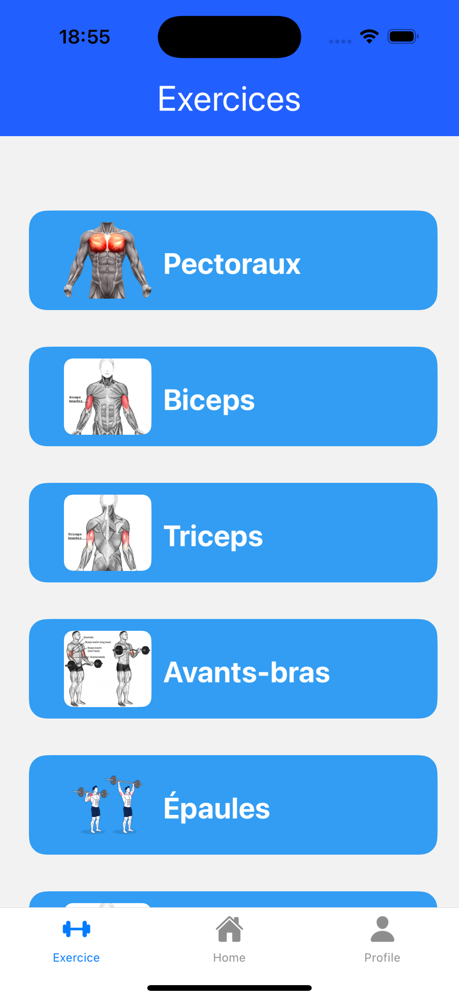
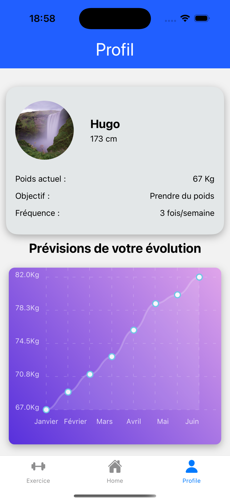

# ActiFit 🏋️‍♂️📱

 <!-- Remplace par le chemin de ton image -->

## Description

**ActiFit** est une application mobile conçue pour aider les utilisateurs à rester en forme en leur fournissant des exercices et des séances d'entraînement. Grâce à une interface utilisateur intuitive, cette application permet de se motiver au quotidien. 💪✨


## Technologies utilisées

- **React Native** : Pour le développement multiplateforme (iOS et Android). 🌐
- **SQLite** : Pour l'authentification des utilisateurs et le stockage des données. ☁️

## Installation

Pour installer et exécuter l'application, suivez ces étapes :

1. Clonez le dépôt :
   ```bash
   git clone https://github.com/Hugo-Galley/ActiFit.git
   cd ActiFit
   ```
2.	Installez les dépendances :
   ```bash
      npm install
   ```
3. Exécutez l’application :
      ```bash
      npm start
   ```
   

## Aperçu de l'application

### Écran d'accueil


### Bibliothèque d'exercices



### Profil

 

## Contribuer

Les contributions sont les bienvenues ! Si vous souhaitez améliorer l'application, n'hésitez pas à ouvrir un problème ou à soumettre une demande de tirage. 🤝🌟

## Licence

Ce projet est sous licence MIT. Voir le fichier [LICENSE](LICENSE) pour plus d'informations. 📜